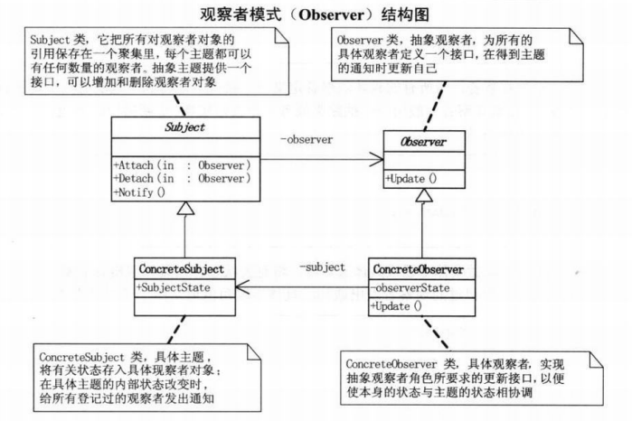
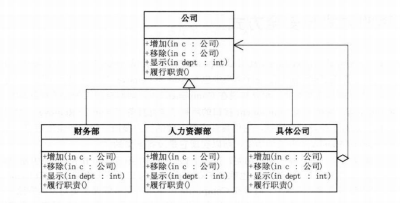
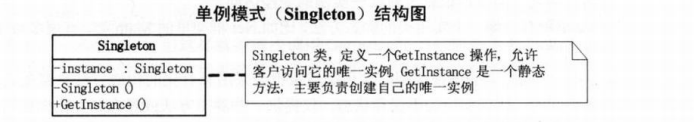
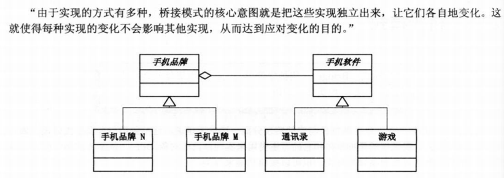

# 大话设计模式
重点：
- 外观（很简单很容易看）over
- 组合（很简单很容易看）over
- 单例（很简单很容易看）over
- 迭代器（很简单很容易看）over
- 工厂（这个特别重要）over
- 观察者（很重要） over
- 职责链（暂时用不上，放后面）

# 一、简单工厂模式
代码要可维护、可扩展、可复用、灵活性好
## 1.1 业务封装
业务逻辑与界面逻辑分开，比如写一个安卓计算器的程序，加减乘除操作的实现放到一个类(operation)中。

将展示页面放到另一个类(show)中，只需要在show类中实例化
operation类，调用对应的方法。

## 1.2 紧耦合与松耦合
进一步，如果要加一个开方的算法，应该如何操作，修改operation类，增加一个sqrt方法即可。

但是增加一个方法需要提供整个operation类，也可能误修改operation中的其他方法。

应该把加减乘除都分类，修改或增加都不影响其它。

**简单工厂模式：**通过一个类（工厂），实例化（生产）其它对象。

# 二、策略模式
面向对象的编程，并不是类越多越好，类的划分是为了封装，但分类的基础是抽象，具有相同属性和功能的对象的抽象合集才是类。

它定义了算法家族，分别封装起来，让他们之间可以互相替换，此模式让算法的变化，不会影响到使用算法的老客户。

策略模式是定义了一系列算法的方法，从概念上看这些算法完成的都是相同的工作，只是实现不同，它可以以相同的方式调用所有的算法啊，减少了各种算法类与使用算法类
之间的耦合。

策略模式的Strategy类层次为Context定义了一系列可供重用的算法或行为。继承有助于析取出这些算法中的公共功能。

策略模式的有点是简化了单元测试，因为每个算法都有自己的类，可以通过自己的接口单独测试。

# 三、单一职责原则
**就一个类而言，应该仅有一个引起它变化的原因**

需要多思考如何拆分职责。

# 四、开放封闭原则

**对于扩展是开放的（open for extension）,对于更改是封闭的（close for modification）**

即，多扩展，少修改。

绝对的修改关闭是不可能的，**无论模块多么'封闭'，都会存在一些无法对之封闭的变化。既然不可能完全封闭，设计人员必须对于他设计的模块应该对哪种变化做出选择。
他必须先猜测出最有可能发生的变化种类，然后构造抽象来隔离那些变化。**

**等到发生变化时立即采取行动。**

**面对需求，对程序的改动是通过增加新代码进行的，而不是更改现有的代码。**

# **依赖倒转原则**
抽象不应该依赖于细节，细节应该依赖于抽象。即要针对接口编程，不要对实现编程。
以电脑为例，无论主板、CPU、硬盘都是针对接口设计，如果针对实现来设计，就要对应到具体某个品牌的主板，那就会出现换内存也会把主板换掉的场景。

原则：
- 高层模块不应该依赖低层模块。两个都应该依赖抽象。
- 抽象不应该依赖细节。细节应该依赖于抽象。

里氏代换原则：
- 一个软件实体如果使用的是一个父类，那么一定适用于其子类，而且它察觉不出父类对象和子类对象的区别，也就是说，在软件里面，把父类都替换成它的子类，程序的行为没有变化。
- 只有当父类可以替换掉父类，软件单位的功能不受到影响时，父类才能真正被复用，而子类也能够在父类的基础上增加新的行为。

**也就是，不管高层模块还是低层模块都依赖于接口或者抽象类，而不是高依赖于低**

# 五、装饰模式

动态地给一个对象添加一些额外的职责，就增加功能来说，装饰模式比生成子类更为灵活。

是为已有的功能动态地添加更多功能的一种方式。当系统需要新功能时，向旧的类中添加新的代码。这些新代码通常装饰了原有类的核心职责或者主要行为。

它把每个要装饰的功能放在单独的类中，并让这个类包装它需要装饰的对象，因此，当需要执行特殊行为时，客户代码就可以在运行时根据需要有选择地、按顺序地使用
装饰功能包装对象了。

# 六、代理模式
为其它对象提供一种代理以控制对这个对象的访问。

- 定义抽象接口，如送礼物接口：送洋娃娃方法、送鲜花方法、送巧克力方法。
- 实现接口者：实现方法:送洋娃娃方法、送鲜花方法、送巧克力方法.
- 让代理也去实现接口方法，但调用的是实现者实现的方法。

# 七、工厂方法模式

定义：定义一个创建对象的接口，让子类决定实例化哪一个类。工厂方法使一个类的实例化延迟到其它子类。

简单工厂模式的最大优点在于工厂类中包含了必要的逻辑判断，根据客户端的选择条件动态实例化相关的类，对于客户端来说，去除了与具体产品的依赖。

# 八、原型模式（Prototype）

定义：用原型示例指定创建对象的种类，并通过拷贝这些原型创建新的对象。

在原型抽象类中创建一个抽象克隆方法。

原型类中有默认值或者默认方法。

克隆后可自由修改部分值。

# 九、模版方法模式（）

# 十、迪米特法则

定义： 如果两个类不必彼此直接通信，那么这两个类就不应该发生直接的相互作用。如果其中一个类需要调用另一个类的某一个方法的话，可以通过第三者转发这个调用。

# 十一、外观模式
定义：为子系统中的一组接口提供一个一致的界面，此模式定义了一个高层接口，这个接口使得这一个子系统更加容易使用。

将子系统复杂的操作逻辑再封装到一个类中。

**在设计初期阶段，应该要有意识的将不同的两个层分离，比如经典的三层架构。**

**其次在开发阶段，子系统往往因为不断的重构烟花而变得越来越复杂**

# 十二、建造者模式

定义：将一个复杂对象的构建与它的表示分离，使得同样的构建过程可以创建不同的表示。

步骤：
-  首先，为创建一个Product对象的各个部件指定抽象接口。

- 然后，建造者Builder实现各个部件接口。

- 最后，指挥者Director确定如何利用实现的接口去搭建。

比如构建一个人，首先抽象类搭出基本架构，头、胳膊、腿抽象接口。进一步根据实际情况，创建大头、粗胳膊、细腿模块。最后由开发者决定先装头再装腿最后装胳膊。

建造者模式是在当创建复杂对象的算法应该独立与该对象的组成部分以及他们的装配方式时适用的模式。

# 十三、观察者模式

定义： 观察者模式定义了一种一对多的依赖关系，让多个观察者对象同时监听某一主题对象。这个主题对象在状态发生变化时，会通知所有观察者对象，使他们能够自动更新自己。

如图所示：
Subject类，是抽象通知者，一般用一个抽象类或者一个接口实现。

Observer类，抽象观察者，为所有的具体观察者定义一个接口，在得到主题的通知时更新自己。通常包含一个Update（）方法。

ConcreteSubject类，具体主题或者具体通知者，将有关状态存入具体观察者对象；在具体主题的内部状态发生改变时，给所有登记过的观察者发出通知

ConcreteObserver类，具体观察者，实现抽象观察者角色所要求的更新接口，以便是本身状态与主题状态相协调。

# 十四、抽象工厂模式
（太抽象了，没完全看懂）
定义：提供一个创建一系列相关或相互依赖对象的接口，而无需指定他们具体的类。

# 十五、 状态模式

定义：当一个对象的内在状态改变时允许改变其行为，这个对象看起来像是改变了其类。

状态模式主要解决的是当控制一个对象状态转换的条件表达式过于复杂时的情况。把状态的判断逻辑转移到表示不同状态的一系列类当中，可以把复杂的判断逻辑简化。

状态模式的好处是将于特定状态相关的行为局部化，并且将不同状态的行为分割开来。

# 十六、适配器模式

定义：将一个类的接口转换成客户希望的另一个接口。Adapter模式使得原本由于接口不兼容而不能一起工作的那些类可以一起工作。

当系统的数据和行为都正确，但接口不符时，我们应该考虑用适配器，目标是使控制范围之外的一个原有对象与某个接口匹配。
适配器模式主要用于希望复用一些现存的类，但是接口又与复用环境要求不一致的情况。

# 十七、备忘录模式（Memento）
（未细看）
备忘录模式：在不破坏封装性的前提下，捕获一个对象的内部状态，并在该对象之外保存这个状态。这样以后就可将该对象恢复到原先保存的状态。

# 十八、组合模式

定义： 将对象组合成树形接口以表示“部分-整体”的层次结构。组合模式使得用户对单个对象和组合对象的使用具有一致性。

当需求中体现的是不分与整体层次的结构时，以及希望用户可以忽略组合对象与单个对象的不同，统一的使用组合结构中的所有对象时，就应该考虑用组合模式了。

# 十九、 迭代器模式（Iterator）

定义： 提供一种方法顺序访问一个聚合对象中各个元素，而又不暴露该对象的内部表示。

当你需要访问一个聚集对象，而且不管这些对象是什么都需要遍历的时候，就应该考虑用迭代器模式。

迭代器是分离了集合对象的遍历行为，抽象出一个迭代器类来负责，这样既可以做大不暴露集合的内部结构，又可以让外部代码透明地访问集合内部的数据。

# 二十、单例模式

单例模式： 保证一个类只有一个实例，并提供一个访问他的全局访问点。

注意多线程访问时的安全问题。

# 二十一、桥接模式

对象的集成关系是在编译时就定义好了，所以无法在运行时改变从父类集成的实现。子类的实现与它的父类有非常紧密的依赖关系，以至于父类实现中的任何变化必然会导致
子类发生变化。当你需要复用子类时，如果继承下来的实现适合解决新的问题，则父类必须重写或者被其他更适合的类替换。这种依赖关系限制了灵活性并最终限制了复用性。

合成/聚合复用原则:尽量使用合成/聚合，尽量不要是使用类继承。

聚合表示一种弱的“拥有”关系，体现的是A对象可以包含B对象，但B对象不是A对象的一部分；合成则是一种强的“拥有”关系，体现了严哥的部分和整体的关系，不分和整体的生命周期一样。

好处：优先使用对象的合成/聚合将有助于你保持每个类被封装，并被集中在单个任务上。这样类和类继承层次会保持较小饿规模，并且不太可能增长为不可控制的庞然大物。

**定义：** 将抽象部分与它的实现部分分离，使他们都可以独立地变化。

# 还剩三章
